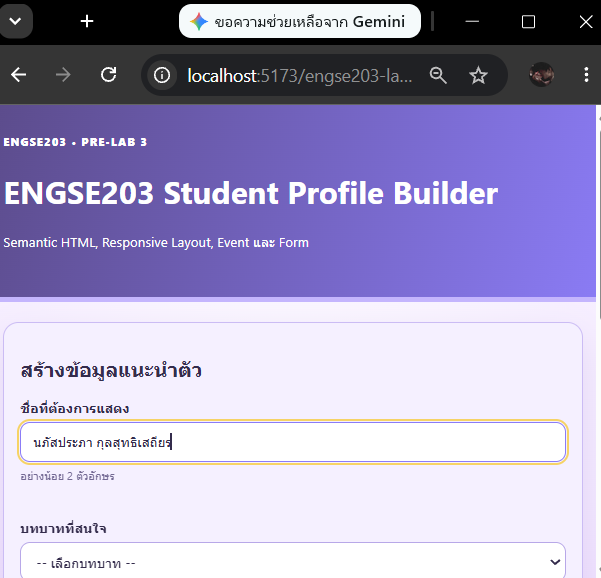
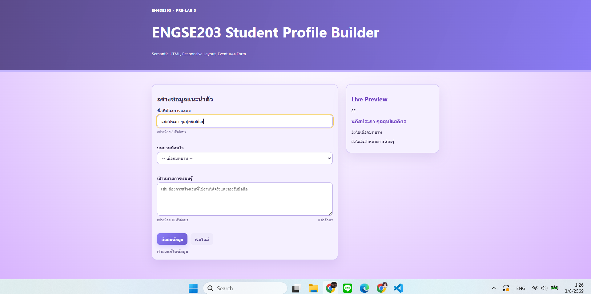
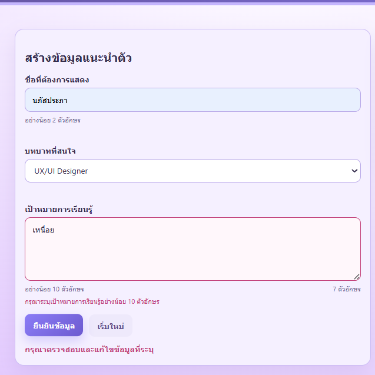
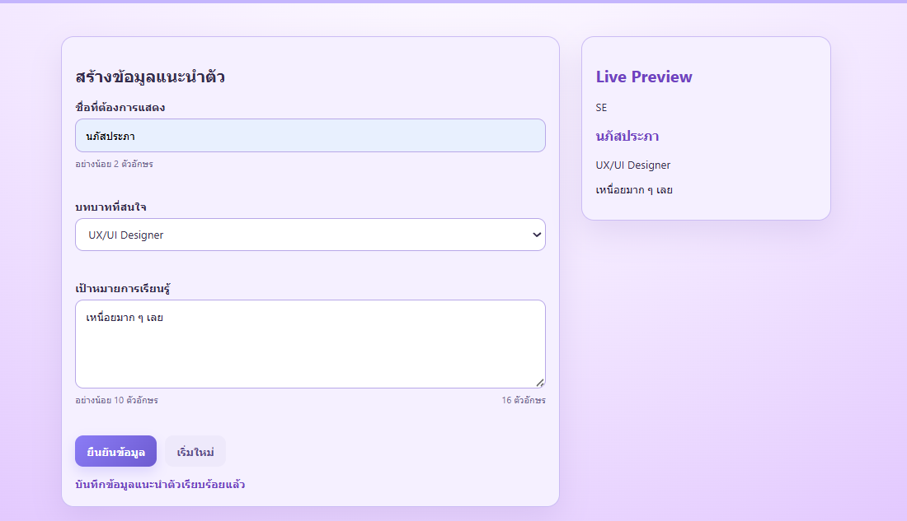

# 💜 ENGSE203 PRE-LAB 3 — Profile Card Builder  
### Responsive Web UI, Form, Event และ Live Preview

## 👩‍💻 ผู้จัดทำ

- **ชื่อ-นามสกุล:** นางสาวนภัสประภา กุลสุทธิเสถียร
- **รหัสนักศึกษา:** 68543210029-3
- **ระบบปฏิบัติการที่ใช้:** Windows 11
- **Repository:** `engse203-lab03-68543210029-3`

---

## 🎯 วัตถุประสงค์ของงาน

- ฝึกออกแบบหน้าเว็บด้วย **Semantic HTML** โดยเลือกใช้ element ให้เหมาะสม เช่น `header`, `main`, `section`, `aside`, `form`, `label`, `input`, `select`, `textarea` และ `button`
- ฝึกสร้างหน้าเว็บแบบ **Responsive Web UI** ที่สามารถปรับรูปแบบการแสดงผลให้เหมาะกับหน้าจอ Mobile, Tablet และ Desktop
- ฝึกใช้งาน **DOM Event** เช่น `input`, `submit` และ `reset` เพื่อควบคุมการทำงานของแบบฟอร์ม
- ฝึกอ่านค่าจากแบบฟอร์มด้วย `FormData` และแสดงข้อมูลแบบ **Live Preview** โดยไม่ต้องโหลดหน้าเว็บใหม่
- ฝึกตรวจสอบข้อมูลด้วย **Client-side Validation** และแสดงข้อความแจ้งเตือนเมื่อผู้ใช้กรอกข้อมูลไม่ครบหรือไม่ถูกต้อง
- ฝึกใช้งาน Git และ GitHub สำหรับจัดเก็บ Source Code รวมถึงสร้างไฟล์สำหรับเผยแพร่เว็บไซต์ผ่าน **GitHub Pages**

---

## ✨ ความสามารถของระบบ

หน้าเว็บ **Profile Card Builder** ใช้สำหรับสร้างข้อมูลแนะนำตัวของนักศึกษา โดยผู้ใช้สามารถกรอกข้อมูลและดูผลลัพธ์ผ่าน Live Preview ได้แบบ Real-time

ระบบประกอบด้วยข้อมูลดังต่อไปนี้

- 👤 ชื่อที่ต้องการแสดง
- 💼 บทบาทที่สนใจ
- 🎯 เป้าหมายการเรียนรู้
- 🔢 ตัวนับจำนวนตัวอักษรของเป้าหมายการเรียนรู้
- 👀 Live Preview ที่เปลี่ยนแปลงตามข้อมูลที่กรอก
- ✅ การตรวจสอบข้อมูลก่อนยืนยัน
- 🔄 ปุ่มเริ่มกรอกข้อมูลใหม่

---

## 🛠️ เครื่องมือที่ใช้

- **HTML5** สำหรับกำหนดโครงสร้างและความหมายของหน้าเว็บ
- **CSS3** สำหรับตกแต่งหน้าเว็บและสร้าง Responsive Layout
- **JavaScript (Vanilla JavaScript)** สำหรับจัดการ Event, Validation และ Live Preview
- **Vite 7.3.6** สำหรับ Development Server และ Production Build
- **Node.js 24.18.0**
- **npm**
- **Git และ GitHub**
- **GitHub Pages**
- **Visual Studio Code**
- **ChatGPT** สำหรับช่วยอธิบายแนวคิด ตรวจสอบข้อผิดพลาด และเสนอแนวทางปรับปรุงโค้ด

---

## 🚀 วิธีติดตั้งและรันโปรเจกต์

### 1. Clone Repository

```bash
git clone https://github.com/napat68/engse203-lab03-68543210029-3.git

## 🚀 วิธีติดตั้งและรันโปรเจกต์

### 2. เข้าไปยังโฟลเดอร์โปรเจกต์

```bash
cd engse203-lab03-68543210029-3
```

### 3. ติดตั้ง Dependencies

```bash
npm install
```

### 4. เปิด Development Server

```bash
npm run dev
```

จากนั้นเปิด URL ที่ Vite แสดงใน Terminal เช่น

```text
http://localhost:5173/engse203-lab03-68543210029-3/
```

### 5. สร้าง Production Build สำหรับ GitHub Pages

```bash
npm run build
```

ไฟล์ที่ Build สำเร็จจะถูกสร้างไว้ในโฟลเดอร์

```text
docs/
```

### 6. ทดลองเปิด Production Build

```bash
npm run preview
```
---

## 📁 โครงสร้างไฟล์

```text
engse203-lab03-68543210029-3/
├── docs/                              # ไฟล์ที่สร้างจาก npm run build
│   ├── assets/
│   │   ├── index-xxxxx.css
│   │   └── index-xxxxx.js
│   └── index.html
├── lab3/                              # ไฟล์ต้นแบบและเอกสาร LAB 3
│   ├── starter/
│   └── INSTRUCTOR_GRADING_CHECKLIST.md
├── pre-lab3/                          # ไฟล์ต้นแบบและเอกสาร Pre-LAB 3
│   ├── starter/
│   ├── INSTRUCTOR_STEP_SCRIPT.md
│   └── README.md
├── public/                            # Static assets
├── src/
│   ├── main.js                        # Event, FormData, Validation และ Live Preview
│   └── style.css                      # ธีมสีม่วงและ Responsive Layout
├── .gitignore
├── index.html                         # โครงสร้าง Profile Card Builder
├── package-lock.json
├── package.json
├── vite.config.js
└── README.md
```
---

## 🧩 รายละเอียดการทำงาน

### 💜 Semantic HTML และ Accessibility

หน้าเว็บใช้โครงสร้าง HTML ที่สื่อความหมายและแบ่งหน้าที่ของแต่ละส่วนอย่างชัดเจน ได้แก่

- `header` สำหรับส่วนหัวของเว็บไซต์
- `main` สำหรับเนื้อหาหลักของหน้าเว็บ
- `section` สำหรับส่วนแบบฟอร์ม
- `aside` สำหรับส่วน Live Preview
- `form` สำหรับรับข้อมูลจากผู้ใช้
- `label` เชื่อมโยงกับ `input`, `select` และ `textarea`
- `aria-describedby` เชื่อมช่องกรอกข้อมูลกับข้อความแนะนำและข้อความ Error
- `role="status"` ใช้ประกาศสถานะหลังจากผู้ใช้กดส่งข้อมูล

การใช้ Semantic HTML ช่วยให้โครงสร้างของหน้าเว็บอ่านและทำความเข้าใจได้ง่ายขึ้น รวมถึงช่วยสนับสนุนการใช้งานผ่านโปรแกรมอ่านหน้าจอและการเข้าถึงด้วยคีย์บอร์ด

---

### 📱 Responsive Layout

หน้าเว็บถูกออกแบบด้วยแนวทาง **Mobile-first** โดยเริ่มจากการจัดวางเนื้อหาแบบหนึ่งคอลัมน์สำหรับหน้าจอขนาดเล็ก แล้วจึงปรับเป็นหลายคอลัมน์เมื่อพื้นที่หน้าจอเพียงพอ

รายละเอียดการแสดงผล ได้แก่

- บนหน้าจอขนาดเล็ก ฟอร์มและ Live Preview จะแสดงเป็นหนึ่งคอลัมน์
- บนหน้าจอ Desktop ฟอร์มและ Live Preview จะแสดงเป็นสองคอลัมน์
- ใช้ CSS Grid และ Flexbox เพื่อจัดวางองค์ประกอบ
- ใช้ `clamp()` เพื่อกำหนดขนาดตัวอักษรให้ปรับตามขนาดหน้าจอ
- ไม่เกิด Horizontal Scroll บนหน้าจอ Mobile
- รองรับการทดสอบที่ขนาดหน้าจอ 375px, 768px และ Desktop

---

### 👀 Event และ Live Preview

ระบบใช้ `input` event เพื่ออ่านค่าจากแบบฟอร์มและอัปเดตข้อมูลในส่วน Live Preview แบบ Real-time โดยไม่ต้องกด Submit ก่อน

เมื่อผู้ใช้กรอกหรือแก้ไขข้อมูล ระบบจะแสดงผลทันทีในส่วน Live Preview ได้แก่

- ชื่อที่ต้องการแสดง
- บทบาทที่สนใจ
- เป้าหมายการเรียนรู้
- จำนวนตัวอักษรที่กรอก

การแสดงข้อมูลใช้ `textContent` แทน `innerHTML` เพื่อช่วยลดความเสี่ยงจากการนำข้อมูลที่ผู้ใช้กรอกไปสร้าง HTML โดยตรง และช่วยให้การแสดงผลมีความปลอดภัยมากขึ้น

---

### ✅ Validation และ Feedback

ระบบตรวจสอบข้อมูลก่อนบันทึก โดยกำหนดเงื่อนไขของแต่ละช่องดังนี้

| ช่องข้อมูล | เงื่อนไข |
|---|---|
| ชื่อที่ต้องการแสดง | ต้องมีอย่างน้อย 2 ตัวอักษร |
| บทบาทที่สนใจ | ต้องเลือกอย่างน้อย 1 บทบาท |
| เป้าหมายการเรียนรู้ | ต้องมีอย่างน้อย 10 ตัวอักษร |

หากผู้ใช้กรอกข้อมูลไม่ถูกต้อง ระบบจะทำงานดังนี้

- แสดงข้อความ Error ใกล้ช่องข้อมูลที่มีปัญหา
- กำหนด `aria-invalid="true"` ให้กับช่องที่กรอกไม่ถูกต้อง
- ไม่ล้างข้อมูลที่ผู้ใช้กรอกไว้
- แสดงสถานะเพื่อแจ้งให้ผู้ใช้ทราบว่าต้องตรวจสอบและแก้ไขข้อมูล

เมื่อผู้ใช้กรอกข้อมูลครบและผ่านเงื่อนไขทั้งหมด ระบบจะแสดงข้อความ

```text
บันทึกข้อมูลแนะนำตัวเรียบร้อยแล้ว
```

---

### 🔄 Reset Form

เมื่อผู้ใช้กดปุ่ม **เริ่มใหม่ (Reset)** ระบบจะรีเซ็ตข้อมูลทั้งหมดภายในแบบฟอร์มและคืนค่าหน้าเว็บกลับสู่สถานะเริ่มต้น โดยมีรายละเอียดดังนี้

- 🗑️ ล้างข้อมูลทั้งหมดในแบบฟอร์ม
- ❌ ล้างข้อความ Error ที่แสดงอยู่
- 🔢 รีเซ็ตจำนวนตัวอักษรกลับเป็น **0**
- 👀 คืนค่า Live Preview เป็นข้อความเริ่มต้น
- ✅ เปลี่ยนสถานะกลับเป็น **พร้อมเริ่มกรอกข้อมูลใหม่**

---

## 🌐 ลิงก์ผลงาน

### 📂 Repository

🔗 https://github.com/napat68/engse203-lab03-68543210029-3

### 🚀 GitHub Pages

🔗 https://napat68.github.io/engse203-lab03-68543210029-3/

### 🔀 Pull Request

🔗 https://github.com/se-rmutl/engse203-lab/pulls?q=is%3Apr+68543210029-3

> **หมายเหตุ:** เปลี่ยนลิงก์ด้านบนเป็น Pull Request ของตนเองหลังจากส่งงานและ Merge เรียบร้อยแล้ว

---

## 🧪 ผลการทดสอบ

| หัวข้อ | ผลการทดสอบ |
|---|---|
| Semantic HTML | ใช้ `header`, `main`, `section`, `aside` และ `form` ตามหน้าที่ |
| Label และ Form Control | `label for` ตรงกับ `id` ของทุกช่อง |
| Live Preview | ข้อมูลเปลี่ยนตามการกรอกแบบ Real-time |
| Character Counter | จำนวนตัวอักษรเปลี่ยนตามข้อความที่กรอก |
| Submit Event | ใช้ `preventDefault()` ป้องกันหน้าเว็บ Reload |
| Validation | ตรวจชื่อ บทบาท และเป้าหมายการเรียนรู้ได้ |
| Reset | ล้างฟอร์ม Error และ Live Preview ได้ |
| Mobile 375px | แสดงผลหนึ่งคอลัมน์และไม่มี Horizontal Scroll |
| Tablet 768px | เนื้อหาและระยะห่างแสดงผลเหมาะสม |
| Desktop | ฟอร์มและ Live Preview แสดงแบบสองคอลัมน์ |
| Console | ไม่มี Error สีแดง |
| Production Build | `npm run build` สำเร็จและสร้างไฟล์ใน `docs/` |

---

## 📸 หลักฐานผลลัพธ์

### 📱 Mobile View — 375px

ภาพแสดงผลการทดสอบหน้าเว็บบนหน้าจอขนาด 375px โดยหน้าเว็บแสดงแบบหนึ่งคอลัมน์และไม่มี Horizontal Scroll



---

### 🖥️ Desktop View

ภาพแสดงผลการทดสอบหน้าเว็บบนหน้าจอ Desktop โดยฟอร์มและ Live Preview แสดงผลแบบสองคอลัมน์



### ⚠️ Error State

ภาพแสดงสถานะ Error เมื่อผู้ใช้กรอกข้อมูลไม่ครบหรือไม่ผ่านเงื่อนไขที่กำหนด



---

### 🎉 Success State

ภาพแสดงสถานะสำเร็จหลังจากผู้ใช้กรอกข้อมูลครบถ้วนและกดยืนยันข้อมูล



---

## 📚 สิ่งที่ได้เรียนรู้

- เข้าใจหน้าที่ของ **HTML, CSS และ JavaScript** ว่าควรแยกความรับผิดชอบออกจากกัน
- เข้าใจการใช้ **Semantic HTML** เพื่อให้โครงสร้างเว็บไซต์อ่านง่ายและรองรับ Accessibility
- เข้าใจความสัมพันธ์ระหว่าง `label`, `for`, `id`, `name` และ `aria-describedby`
- สามารถใช้ `FormData` เพื่ออ่านค่าจากแบบฟอร์มได้
- เข้าใจการใช้งาน Event ได้แก่ `input`, `submit` และ `reset`
- สามารถแสดงข้อมูลในส่วน **Live Preview** และนับจำนวนตัวอักษรแบบ Real-time ได้
- เข้าใจการใช้ `preventDefault()` เพื่อป้องกันการ Reload หน้าเว็บเมื่อ Submit ฟอร์ม
- สามารถสร้าง Validation และแสดง Error Message ใกล้ช่องข้อมูลที่ไม่ผ่านเงื่อนไขได้
- เข้าใจแนวทางการออกแบบแบบ **Mobile-first**
- สามารถใช้ Media Query เพื่อปรับเปลี่ยน Layout ให้เหมาะสมกับขนาดหน้าจอ
- สามารถใช้ Git, GitHub, Vite และ GitHub Pages ในการพัฒนาและเผยแพร่เว็บไซต์ได้
- เข้าใจความแตกต่างระหว่างไฟล์ Source Code ในโฟลเดอร์ `src/` และไฟล์ Production Build ในโฟลเดอร์ `docs/`

---

## 📖 References & AI Assistance

### 📚 Source และ Documentation

- [ENGSE203 Week 03 — Responsive Web UI](https://github.com/se-rmutl/engse203-lab/tree/main/labs/week-03-responsive-ui)
- [Pre-LAB 3 — Profile Card Builder](https://github.com/se-rmutl/engse203-lab/tree/main/labs/week-03-responsive-ui/pre-lab3)
- [LAB 3 — Campus Service Request](https://github.com/se-rmutl/engse203-lab/tree/main/labs/week-03-responsive-ui/lab3)
- [Vite Documentation](https://vite.dev/)
- [MDN Web Docs — FormData](https://developer.mozilla.org/en-US/docs/Web/API/FormData)
- [MDN Web Docs — Event.preventDefault()](https://developer.mozilla.org/en-US/docs/Web/API/Event/preventDefault)

---

### 🤖 เครื่องมือ AI ที่ใช้

- **AI Tool:** ChatGPT

### 💡 การนำ AI มาใช้

ใช้ ChatGPT เพื่อช่วยในส่วนดังต่อไปนี้

- อธิบายวิธีติดตั้ง Git, Node.js และ npm บนระบบปฏิบัติการ Windows
- วิเคราะห์และช่วยแก้ไขข้อผิดพลาดที่เกิดขึ้นใน Terminal
- อธิบายความแตกต่างระหว่างคำสั่ง `npm run dev` และ `npm run build`
- ตรวจสอบการเชื่อมโยงระหว่าง `index.html`, `src/main.js` และ `src/style.css`
- อธิบายการใช้งาน DOM Event, `FormData`, Validation และ Live Preview
- ช่วยตรวจสอบชื่อ `id`, `name` และ Selector ให้ตรงกันระหว่าง HTML และ JavaScript
- เสนอแนวทางปรับ Responsive Layout ให้รองรับหน้าจอหลายขนาด
- ช่วยเรียบเรียงเนื้อหาใน `README.md`
- ช่วยสรุปขั้นตอนและกระบวนการทำงานของโปรเจกต์

---

### 🛠️ การปรับใช้ด้วยตนเอง

ผู้จัดทำได้ศึกษาคำอธิบายและนำข้อเสนอแนะไปปรับใช้กับโปรเจกต์ด้วยตนเอง โดยเฉพาะในส่วนต่อไปนี้

- การปรับโครงสร้าง HTML
- การกำหนดชื่อ Field และ Selector
- การเขียน Validation
- การสร้าง Live Preview
- การนับจำนวนตัวอักษร
- การปรับ Mobile-first Layout
- การแก้ไขค่า `base` ใน `vite.config.js`
- การทดสอบด้วย `npm run dev`
- การ Build ไฟล์ด้วย `npm run build`
- การเตรียมไฟล์สำหรับเผยแพร่ผ่าน GitHub Pages

AI ถูกใช้เป็นเครื่องมือช่วยอธิบาย ตรวจสอบข้อผิดพลาด และเสนอแนวทาง ส่วนการแก้ไข ทดลอง ทดสอบ และตัดสินใจเลือกใช้งานเป็นการดำเนินการของผู้จัดทำเอง

## Submission
LAB Week 03 completed.